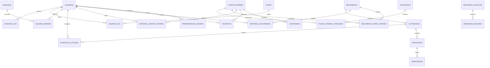

# Diseno de base de datos

## 1. Proposito

El diseno de base de datos propuesto organiza la informacion necesaria para una aplicacion web responsive de difusion patrimonial con realidad aumentada, navegacion SIG, recorridos historicos, contenidos multimedia, gamificacion y administracion mediante CMS.

El prototipo actual no implementa una base de datos real, pero sus pantallas se han construido de forma coherente con las entidades del modelo aprobado.

## 2. Bloques del modelo

| Bloque | Ambito | Entidades principales |
| --- | --- | --- |
| Bloque 1 | Gestion de usuarios y acceso | usuarios, roles, idiomas, preferencias_usuario, grupo_usuario, favoritos |
| Bloque 2 | Recorridos y contenidos | recorridos, puntos_interes, categorias, contenidos, historial_recorridos |
| Bloque 3 | Gamificacion y CMS | actividades, preguntas, respuestas, insignias, recursos_digitales, versiones_recurso |

## 3. Bloque 1: Gestion de usuarios y acceso

Este bloque permite representar usuarios, roles, idioma, preferencias, favoritos y grupos.

### Entidades destacadas

| Entidad | Funcion |
| --- | --- |
| usuarios | Almacena datos de acceso, registro, proveedor de autenticacion e idioma. |
| roles | Define perfiles como administrador, editor, docente o visitante registrado. |
| usuario_rol | Resuelve la relacion entre usuarios y roles. |
| idiomas | Permite internacionalizacion de interfaz y contenidos. |
| preferencias_usuario | Guarda preferencias como idioma, accesibilidad o texto grande. |
| favoritos | Relaciona usuarios con puntos de interes marcados. |
| grupos | Representa grupos educativos o de visita. |
| grupo_usuario | Relaciona usuarios con grupos. |
| sugerencias_usuario | Permite registrar recomendaciones mostradas, aceptadas o descartadas. |

### Relacion con el prototipo

| Pantalla | Entidades relacionadas |
| --- | --- |
| `acceso.html` | usuarios, roles, usuario_rol |
| `perfil.html` | usuarios, favoritos, historial_recorridos, historial_puntos_interes |
| `ajustes.html` | preferencias_usuario, idiomas |

## 4. Bloque 2: Recorridos y contenidos

Este bloque modela los puntos de interes, recorridos historicos, contenidos asociados e historial de visita.

### Entidades destacadas

| Entidad | Funcion |
| --- | --- |
| puntos_interes | Define POI con titulo, descripcion, latitud, longitud y epoca historica. |
| categorias | Clasifica puntos de interes por tematica patrimonial. |
| punto_interes_categoria | Resuelve la relacion N:M entre POI y categorias. |
| recorridos | Define rutas historicas con tipo, duracion y linea temporal. |
| recorrido_punto_interes | Ordena los POI dentro de cada recorrido. |
| contenidos | Almacena textos, audios, imagenes, videos o recursos asociados a POI. |
| historial_recorridos | Registra inicio, fin, progreso y tiempo total de recorridos. |
| historial_puntos_interes | Registra visitas a POI y tiempo de visualizacion. |

### Relacion con el prototipo

| Pantalla | Entidades relacionadas |
| --- | --- |
| `mapa.html` | puntos_interes, categorias |
| `detalle-poi.html` | puntos_interes, contenidos |
| `recorridos.html` | recorridos, recorrido_punto_interes, historial_recorridos |
| `home.html` | puntos_interes, recorridos |

## 5. Bloque 3: Gamificacion, recursos y CMS

Este bloque permite ampliar el prototipo con actividades educativas, insignias, versionado de recursos y publicacion programada.

### Entidades destacadas

| Entidad | Funcion |
| --- | --- |
| actividades | Define actividades interactivas asociadas a recorridos. |
| preguntas | Preguntas de cuestionarios educativos. |
| respuestas | Respuestas posibles y validacion de opcion correcta. |
| intentos_actividad | Registra puntuacion y finalizacion de actividades por usuario. |
| insignias | Define recompensas digitales obtenibles. |
| usuario_insignia | Relaciona usuarios con insignias obtenidas. |
| recursos_digitales | Gestiona archivos multimedia y modelos. |
| versiones_recurso | Permite versionado de recursos digitales. |
| eventos_uso | Registra eventos anonimizables para analitica. |
| publicaciones_programadas | Permite programar contenidos desde el CMS. |

### Relacion con el prototipo

| Pantalla | Entidades relacionadas |
| --- | --- |
| `vista-ra.html` | recursos_digitales, versiones_recurso |
| `perfil.html` | intentos_actividad, usuario_insignia, eventos_uso |
| `recorridos.html` | actividades, preguntas, respuestas |
| Futuro CMS | publicaciones_programadas, versiones_recurso, eventos_uso |

## 6. Trazabilidad base de datos - casos de uso

| Modulo CU | Casos principales | Entidades relacionadas |
| --- | --- | --- |
| Modulo A | CU-01 a CU-10 | usuarios, roles, usuario_rol, preferencias_usuario, idiomas |
| Modulo B | CU-11 a CU-15 | puntos_interes, categorias, favoritos |
| Modulo C | CU-16 a CU-20 | recursos_digitales, versiones_recurso, contenidos |
| Modulo D | CU-21 a CU-27, CU-46 | recorridos, recorrido_punto_interes, historial_recorridos |
| Modulo E | CU-28 a CU-32 | contenidos, puntos_interes, categorias |
| Modulo F | CU-33 a CU-37 | actividades, preguntas, respuestas, intentos_actividad, insignias |
| Modulo G | CU-38 a CU-45 | publicaciones_programadas, recursos_digitales, versiones_recurso, eventos_uso |

## 7. Diagrama logico resumido

## 8. Observaciones profesionales

El modelo permite evolucionar desde el prototipo estatico hacia una arquitectura con backend, autenticacion, CMS, analitica y persistencia. La division por bloques facilita justificar una implementacion incremental: primero usuarios, POI y recorridos; despues RA, multimedia, gamificacion y CMS.
